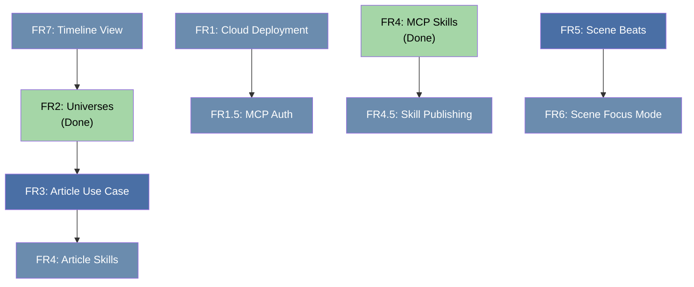

# Word Coach Annie — Future Requirements

> Forward-looking design document covering cloud readiness, data model evolution,
> expanded use cases, and the MCP skills architecture.

---

## FR1: Cloud Deployment & Security

### Goal
Make Word Coach Annie deployable to the cloud as a multi-user SaaS while keeping the
local-first option intact.

### 1.1 Authentication — Google Auth via Supabase

| Concern | Approach |
|---|---|
| **Identity Provider** | Google OAuth via Supabase Auth (or NextAuth.js with Google provider) |
| **Session Management** | JWT sessions with short-lived access tokens + refresh tokens |
| **User Isolation** | Every `Project` gets a `userId` foreign key; all queries scoped by authenticated user |

**Migration path:**
1. Add `userId` column to `Project` (nullable during transition).
2. Wrap all API routes in auth middleware that rejects unauthenticated requests in cloud mode; passes through in local mode.
3. Introduce an `AUTH_MODE` env var (`local` | `cloud`) so the same codebase serves both.

### 1.2 Database — SQLite → Supabase (Postgres)

| Concern | Approach |
|---|---|
| **ORM** | Prisma already abstracts the DB — switch `provider` from `sqlite` to `postgresql` |
| **Migration** | `prisma migrate` generates the diff automatically |
| **Row-Level Security** | Supabase RLS policies scoped to `auth.uid()` on every table |
| **Backups** | Supabase handles automated backups; replaces local Git snapshots |

> [!IMPORTANT]
> Prisma's SQLite dialect differs from Postgres in a few areas (e.g., `@default(cuid())`
> works in both, but `@@index` and `DateTime` handling need testing during migration).

### 1.3 Hosting

| Option | Pros | Cons |
|---|---|---|
| **Vercel** | Zero-config Next.js deploy, serverless | Cold starts, no persistent process for MCP |
| **Railway / Render** | Persistent container, similar to current Docker setup | Slightly more ops |
| **Google Cloud Run** | Scales to zero, pairs well with Supabase | More config |

**Recommendation:** Railway or Render for v1 cloud deploy — closest to the existing Docker
setup, supports persistent processes (needed for MCP stdio).

### 1.4 Abuse Concerns

| Risk | Severity | Mitigation |
|---|---|---|
| **Storage abuse** (giant projects) | Medium | Per-user storage quotas; limit content versions to 50 per scene (already done) |
| **API abuse** (scraping/spam) | Medium | Rate limiting on API routes (e.g., `express-rate-limit` or Vercel edge middleware) |
| **AI proxy abuse** (using the tool to burn Gemini quota) | High | AI features gated behind user's own API key; never expose shared credentials |
| **Data exfiltration** | Low | RLS + auth middleware prevent cross-user reads |
| **MCP abuse** (unauthorized agent access) | High | See §1.5 |

### 1.5 MCP Authentication in Cloud Mode

The MCP spec (as of Nov 2025) supports **OAuth 2.1** natively:

- **MCP server = OAuth Resource Server.** It advertises its Authorization Server via protected resource metadata.
- **Token scoping:** Use RFC 8707 Resource Indicators to ensure tokens are scoped to this specific MCP server.
- **Dynamic Client Registration (RFC 7591):** Allows new MCP clients (e.g., a user's Gemini CLI) to self-register.

**Practical plan:**
1. In **local mode**: MCP continues to use stdio transport with no auth (same as today).
2. In **cloud mode**: Switch to **SSE or Streamable HTTP transport** with OAuth 2.1.
   - Supabase Auth issues the tokens.
   - MCP server validates the bearer token + `userId` on every request.
   - Scopes: `read`, `write`, `export`, `admin` — least-privilege per tool.

> [!WARNING]
> Stdio transport (current) is inherently local — it cannot be exposed over the network.
> Cloud MCP requires migrating to HTTP-based transport (SSE or Streamable HTTP).

---


## FR3: Article / Non-Fiction Writing Use Case

### Vision
Use Word Coach Annie as a consistent-voice article factory. A "project" called
*"Views on AI Safety"* contains multiple articles, each maintaining a consistent
perspective, terminology, and argument framework.

### How It Maps to the Current Model

| Fiction Concept | Article Concept | Model Mapping |
|---|---|---|
| Project | Article Collection / Publication | `Project` (title = "Views on AI Safety") |
| Part | Article Series or Theme grouping | `StructureNode` type=PART |
| Chapter | Individual Article | `StructureNode` type=CHAPTER |
| Scene | Article Section (intro, argument, conclusion) | `StructureNode` type=SCENE |
| Character | N/A or "Persona" (author voice) | `StoryObject` type=CHARACTER |
| World Element | Key Concept / Framework / Definition | `StoryObject` type=WORLD_ELEMENT |
| Plotline | Argument Thread / Thesis | `StoryObject` type=PLOTLINE |
| Note | Research Note / Source | `StoryObject` type=NOTE |
| Location | N/A | Unused |
| Relationship | "Concept X REFERENCED_IN Article Y" | `Relationship` |

### What Needs to Change

1. **Project Templates.** Add a `projectType` field (`FICTION` | `ARTICLE_COLLECTION` | `GENERAL`) that customizes the UI labels:
   - "Chapter" → "Article", "Scene" → "Section", "Character" → "Persona", etc.
   - Template-driven label map, not hard-coded.

2. **Export Formats.** Add Medium-compatible Markdown export:
   - Front matter for Medium (title, subtitle, tags).
   - Single-article export (one chapter) as well as full collection.
   - Optional: direct Medium API publishing via their REST API.

3. **Consistency Tools.** Leverage relationships + AI to check:
   - Terminology consistency across articles (is "AI alignment" used consistently vs "AI safety"?).
   - Cross-reference validation (does Article B contradict Article A's thesis?).

> [!TIP]
> This use case benefits enormously from the Universe model (FR2). A Universe called
> "AI Safety Concepts" could feed consistent definitions into multiple article collections.

---


## FR5: Scene Beats

### Problem
Scenes are usually split into "beats" — discrete narrative moments that guide the writer
through the prose. Currently, there's no way to annotate scenes with beats, so the writer
has to keep the scene structure in their head or in a separate document.

### What Are Beats?

A **beat** is a short description that guides the writer on what the next set of paragraphs
should accomplish. Think of it as an inline outline within the scene itself:

- *"Kira enters the tavern and scans for the informant."*
- *"Tension rises as the barkeeper recognizes her."*
- *"She bluffs her way through the confrontation and gets the information."*

Beats are **authoring aids only** — they must **not** appear in exported text.

### Implementation: Markdown Annotations

Beats are stored as special markdown annotations within the scene content. This keeps
them inline with the prose and avoids a separate data model.

**Format:**
```markdown
<!-- beat: Kira enters the tavern and scans for the informant. -->

The door groaned as Kira pushed it open. Stale ale and woodsmoke
hit her before she'd taken two steps inside...

<!-- beat: Tension rises as the barkeeper recognizes her. -->

"Well, well." The barkeeper set down his rag. "Didn't think
you'd show your face here again."
```

### Storage

- Beats are stored **inline** in the scene's markdown content using `<!-- beat: ... -->` HTML comments.
- No separate database model is needed.
- The editor parses these comments and renders them as distinct UI elements (e.g., colored divider bars or annotation cards between prose blocks).

### UI

| Aspect | Behavior |
|---|---|
| **Display** | Beats render as visually distinct dividers/cards between prose blocks (e.g., a subtle colored bar with the beat description) |
| **Adding** | Writer can insert a new beat at the cursor position via a toolbar button or keyboard shortcut |
| **Editing** | Clicking on a beat opens it for inline editing |
| **Reordering** | Beats move naturally with the prose they precede |
| **Multiple per scene** | A scene can have any number of beats |
| **Collapsing** | Beats can be toggled visible/hidden for distraction-free writing |

### Export Behavior

- The export pipeline (`exportProject`, `exportForMedium`, etc.) **strips** all `<!-- beat: ... -->` comments from the output.
- This is a simple regex removal during export: `<!-- beat:.*?-->`

> [!NOTE]
> Beats are intentionally lightweight — just HTML comments. This means they survive
> any markdown processor and don't require custom syntax. The editor gives them a
> rich UI, but the underlying format is portable.

---

## FR6: Scene Focus Mode

### Problem
When writing a scene, the writer needs to reference related characters, locations, plot
points, and world elements. Currently, this information is scattered across different
panels and pages, requiring constant navigation away from the writing surface.

### Vision
A **Scene Focus Mode** is a dedicated full-screen writing environment where everything
the writer needs for the current scene is consolidated into one view.

### Layout

```
┌─────────────────────────────────────────────────────┐
│  Scene Focus Mode: "The Tavern Confrontation"       │
├───────────────┬─────────────────────┬───────────────┤
│               │                     │               │
│  Scene Info   │   Writing Surface   │  Related      │
│  ───────────  │   ─────────────────  │  Elements     │
│  • Chapter    │                     │  ───────────  │
│  • Synopsis   │   [Full editor      │  • Characters │
│  • Status     │    with beats]      │  • Locations  │
│  • Word count │                     │  • Plotlines  │
│               │                     │  • World Elts │
│  Navigation   │                     │  • Notes      │
│  ───────────  │                     │               │
│  ← Prev scene │                     │  [Expandable  │
│  → Next scene │                     │   cards with  │
│               │                     │   details]    │
└───────────────┴─────────────────────┴───────────────┘
```

### Features

| Feature | Description |
|---|---|
| **Central writing surface** | Full scene editor with beat support (FR5) |
| **Scene metadata sidebar** | Chapter context, synopsis, status, word count |
| **Related elements panel** | All story objects linked to this scene via relationships, displayed as expandable cards showing name, description, and notes |
| **Scene navigation** | Quick prev/next buttons to move between scenes without leaving focus mode |
| **Distraction-free option** | Ability to collapse both sidebars for a minimal writing experience |
| **Keyboard-driven** | Shortcuts for toggling panels, navigating scenes, inserting beats |

### Entry Points

- Click a "Focus" button on any scene in the structure tree or outline view.
- URL: `/project/[id]/scene/[sceneId]/focus`

> [!TIP]
> Focus Mode pairs naturally with Scene Beats (FR5). The writing surface shows
> beats as inline guides, and the sidebar shows the related context — together
> they give the writer everything needed to draft the scene.

---

## FR7: Timeline View

### Problem
Stories have events happening to multiple characters and objects over time. It's hard
to visualize how different storylines intersect, where characters overlap, and whether
the chronology is consistent.

### Vision
A **Timeline View** that shows events chronologically, with one row per story object
(character, location, plotline, etc.), and markers showing when things happen and how
they affect each other.

### Layout

```
         Time →
         Ch.1    Ch.2    Ch.3    Ch.4    Ch.5
         ┃       ┃       ┃       ┃       ┃
 Kira    ─●───────●───────────────●───────●─
              arrives    ╲       captured  escapes
                          ╲
 Marcus  ─────────●────────●──────●─────────
              meets Kira  betrayal  regret
                                ╱
 The     ─────────────────●────●───────────
 Tavern              confrontation  burned
```

### Data Source

- **Scenes as time units.** Each scene (or chapter) represents a point on the timeline. The horizontal axis is the scene/chapter order from the structure tree.
- **Story object relationships.** Rows are story objects (characters, locations, plotlines). Events are derived from which scenes each object is linked to via relationships.
- **WorldObject timeline entries (FR2).** If universes are implemented, WorldObject timeline entries can also be plotted as additional markers.

### Features

| Feature | Description |
|---|---|
| **One row per object** | Each character, location, or plotline gets its own horizontal row |
| **Scene columns** | Columns correspond to scenes (or chapters) in story order |
| **Event markers** | Dots/icons where an object appears in or is affected by a scene |
| **Connection lines** | Visual lines connecting related events across rows (e.g., two characters in the same scene) |
| **Hover details** | Hovering an event marker shows the relationship type and scene synopsis |
| **Filtering** | Filter rows by object type (only characters, only locations, etc.) |
| **Click to navigate** | Clicking an event marker opens that scene (or enters Focus Mode) |
| **Zoom levels** | Toggle between chapter-level (broad) and scene-level (detailed) views |

### URL

`/project/[id]/timeline`

Accessible via a "Timeline" tab or button on the project page.

> [!IMPORTANT]
> The timeline view is read-only for v1 — it visualizes existing relationships.
> Editing events or relationships should still be done through the normal UI.
> Future versions could allow drag-and-drop to reorder scenes or create
> relationships directly from the timeline.

---

## Priority & Dependencies



| Priority | Requirement | Effort | Blocked By |
|---|---|---|---|
| 🟢 **Do first** | FR5: Scene Beats | Small | Nothing — markdown annotations + editor UI |
| 🟢 **Do first** | FR3: Article templates | Small | FR2 (Completed) |
| 🟡 **Do second** | FR6: Scene Focus Mode | Medium | FR5 (beats integrate into the writing surface) |
| 🟡 **Do second** | FR7: Timeline View | Medium | Benefits from FR2 (Completed) |
| 🟡 **Do second** | FR1: Cloud (auth + Supabase) | Large | Nothing, but high effort |
| 🔴 **Do last** | FR1.5: MCP auth (cloud) | Medium | FR1 (needs cloud infra first) |
| 🔴 **Do last** | FR4.5: Skill publishing | Small | FR4 (Completed) + ecosystem maturity |

---

## Decisions Made

| # | Question | Decision |
|---|---|---|
| 1 | Universe UI | ✅ **Top-level page** alongside Dashboard, not a tab within Project |
| 2 | Character changes across stories | ✅ **Internal timeline** on WorldObjects — ordered entries track evolution over time, enabling consistency checks within and across stories |
| 3 | Skill authoring UI | ✅ **No UI** — Skills are curated Markdown files shipped read-only; author-maintained |
| 4 | Multi-tenancy model | ✅ **Supabase RLS** — single database with row-level security policies scoped to `auth.uid()` |
| 5 | Timeline granularity | ✅ **Free-form labels with enforced ordering.** Labels start vague ("Around 20 years old") and get refined as stories develop ("At 22, during the Siege of Keld"). `orderIndex` is the canonical sequence; labels are descriptive. |
| 6 | Universe sharing (cloud) | ✅ **Single-owner.** Universes are always owned by one user — no collaborative sharing. |
| 7 | Medium API key | ✅ **Personal API token**, stored encrypted (AES-256 at rest via env-configured secret). Simpler than OAuth for v1; acceptable risk since the token is user-provided and per-account. |
| 8 | Beat storage format | ✅ **HTML comments** (`<!-- beat: ... -->`) inline in scene markdown. No separate DB model. Lightweight, portable, stripped on export. |
| 9 | Focus Mode layout | ✅ **Three-panel layout**: scene info (left), writing surface (center), related elements (right). Both sidebars collapsible for distraction-free mode. |
| 10 | Timeline data source | ✅ **Derived from relationships**. Timeline plots which scenes each story object appears in — no new data model. Optional integration with WorldObject timeline entries (FR2) when available. |

---

## Appendix A: Step-by-Step Implementation Guide

> **For AI agents**: Follow these steps EXACTLY. Do NOT make design decisions.
> If something is ambiguous, stop and ask the user. Use the `/dev` workflow
> (`.agent/workflows/dev.md`) for every change, and the `/implement-feature`
> workflow (`.agent/workflows/implement-feature.md`) for order of operations.

---

### A1: FR2 — Universe Model (Completed)
[Moved to REQUIREMENTS.md]

---

### A2: FR4 — MCP Skills (Completed)
[Moved to REQUIREMENTS.md]


---

### A3: FR3 — Article Templates (Do Second, after A1)

#### Step 1: Schema — Add `projectType` to `Project`

Add to existing `Project` model in `prisma/schema.prisma`:
```prisma
  projectType  String @default("FICTION")  // FICTION, ARTICLE_COLLECTION, GENERAL
```

#### Step 2: Types — Add label maps to `src/lib/types.ts`

```typescript
export const PROJECT_TYPE_LABELS: Record<string, Record<string, string>> = {
  FICTION: {
    PART: "Part", CHAPTER: "Chapter", SCENE: "Scene",
    CHARACTER: "Character", LOCATION: "Location",
    PLOTLINE: "Plotline", WORLD_ELEMENT: "World Element", NOTE: "Note"
  },
  ARTICLE_COLLECTION: {
    PART: "Series", CHAPTER: "Article", SCENE: "Section",
    CHARACTER: "Persona", LOCATION: "—",
    PLOTLINE: "Thesis", WORLD_ELEMENT: "Key Concept", NOTE: "Research Note"
  },
  GENERAL: {
    PART: "Part", CHAPTER: "Chapter", SCENE: "Section",
    CHARACTER: "Character", LOCATION: "Location",
    PLOTLINE: "Thread", WORLD_ELEMENT: "Element", NOTE: "Note"
  }
};
```

#### Step 3: UI — Use label maps throughout

Replace hardcoded strings in `src/components/` and `src/app/project/` with lookups from `PROJECT_TYPE_LABELS[project.projectType]`.

#### Step 4: Export — Add Medium format

Add to `src/mcp/tools/export.ts` and `src/lib/controllers/structure.ts`:
- `exportForMedium(nodeId)` — export a single Chapter/Article as Markdown with Medium front matter (title, subtitle, tags pulled from StoryObject tags)

---

### A4: FR1 — Cloud Deployment (Do Second, high effort)

> **⚠️ This is a large feature. Break it into sub-PRs:**
> 1. Add `userId` to schema + auth middleware (no Supabase yet — just the plumbing)
> 2. Swap SQLite for Postgres via Prisma provider change
> 3. Integrate Supabase Auth
> 4. Add RLS policies
> 5. Deploy to Railway/Render

Detailed steps for each sub-PR are deferred until FR2 and FR4 are complete and stable.

---

### A5: FR5 — Scene Beats (Do First, parallel with A1/A2)

#### Step 1: Tiptap Extension — Create `src/components/editor/beat-extension.ts`

Create a custom Tiptap node extension for beats:
- Node name: `beatAnnotation`
- Renders `<!-- beat: ... -->` HTML comments as styled block elements in the editor
- Stores the beat text as a node attribute
- Renders in the editor as a colored divider bar with the beat text
- Serializes back to `<!-- beat: {text} -->` in the markdown output
- Input rule: typing `<!-- beat:` triggers the extension

#### Step 2: Editor Toolbar — Add beat insert button

In the scene editor toolbar (`src/components/scene-editor.tsx` or equivalent):
- Add a "+ Beat" button that inserts a `beatAnnotation` node at the cursor
- Add a keyboard shortcut (e.g., `Ctrl+Shift+B`) for the same action

#### Step 3: Beat Visibility Toggle

- Add a toggle button in the editor toolbar to show/hide beat annotations
- When hidden, beats are still in the document but rendered with `display: none`
- Default: visible

#### Step 4: Export Stripping

In `src/lib/controllers/structure.ts` (the export functions):
- Add a `stripBeats(content: string): string` utility that removes `<!-- beat:.*?-->` with surrounding whitespace
- Call it in `exportProject` and any other export functions before outputting content

#### Step 5: Styling

Add CSS for the beat annotation node:
- Subtle background color (use the design system's accent color at low opacity)
- Small icon (e.g., a bookmark or pin) before the beat text
- Italic text, slightly smaller than body text
- Bottom border to visually separate from the prose below

#### Step 6: Tests

Create `src/__tests__/beats.test.ts`:
- Test beat insertion into markdown content
- Test beat stripping from export output
- Test that beats survive markdown round-trip (serialize → deserialize)

---

### A6: FR6 — Scene Focus Mode (Do Second, after A5)

#### Step 1: Route — Create `src/app/project/[id]/scene/[sceneId]/focus/page.tsx`

New page with three-panel layout:
- **Left sidebar**: Scene metadata (chapter name, synopsis, status, word count)
- **Center**: Full scene editor (reuse existing editor component, with beat support)
- **Right sidebar**: Related elements panel

#### Step 2: Related Elements Panel — Create `src/components/focus-mode/related-elements-panel.tsx`

Fetch and display all story objects linked to the scene via relationships:
- Use the existing relationships API to find linked story objects
- Group by type (Characters, Locations, Plotlines, World Elements, Notes)
- Render each as an expandable card showing name, description, and notes
- Cards are read-only in focus mode (click to expand/collapse)

#### Step 3: Scene Info Sidebar — Create `src/components/focus-mode/scene-info-sidebar.tsx`

- Show: parent chapter name, scene synopsis (from `StructureNode.synopsis`), scene status, word count
- Scene navigation: prev/next buttons that navigate to adjacent scenes in structure order
- Use the structure tree API to determine scene ordering

#### Step 4: Layout & Responsiveness

- Three-panel layout using CSS Grid
- Both sidebars collapsible via toggle buttons (store state in localStorage)
- When sidebars are collapsed, the writing surface expands to fill available space
- Keyboard shortcuts: `Ctrl+[` toggle left sidebar, `Ctrl+]` toggle right sidebar

#### Step 5: Entry Points

- Add a "Focus" button (icon: expand/fullscreen) to each scene in the structure tree panel
- Add a "Focus" button to the scene editor header on the project page
- Both link to `/project/[id]/scene/[sceneId]/focus`

#### Step 6: Tests

Create `src/__tests__/focus-mode.test.ts`:
- Test that the page loads with correct scene data
- Test that related elements are fetched and displayed
- Test prev/next navigation

---

### A7: FR7 — Timeline View (Do Second, after relationships are populated)

#### Step 1: Route — Create `src/app/project/[id]/timeline/page.tsx`

New page accessible from the project page via a "Timeline" tab/button.

#### Step 2: Data Fetching — Create `src/lib/controllers/timeline.ts`

New controller with:
```typescript
export async function getTimelineData(projectId: string): Promise<TimelineData> {
  // 1. Fetch all scenes in order (from structure tree)
  // 2. Fetch all story objects for the project
  // 3. Fetch all relationships linking objects to scenes
  // 4. Build a matrix: rows = objects, columns = scenes, cells = relationship info
  // Return structured data for the timeline component
}
```

#### Step 3: Timeline Component — Create `src/components/timeline/timeline-view.tsx`

Visualization component:
- Horizontal axis: scenes/chapters in order (column headers)
- Vertical axis: story objects (row headers, grouped by type)
- Cell markers: dots/icons where a relationship exists between the object and the scene
- Connection lines between markers in the same row
- Hover tooltip showing relationship type and scene synopsis

#### Step 4: Filtering — Create `src/components/timeline/timeline-filters.tsx`

- Filter checkboxes by object type (Characters, Locations, Plotlines, etc.)
- Toggle between chapter-level and scene-level granularity
- Filter persisted in URL query params

#### Step 5: Interaction

- Click a marker → navigate to the scene (or open Focus Mode if available)
- Click a row header → open the story object detail panel
- Zoom: toggle between chapter-level (show chapters as columns) and scene-level (show all scenes)

#### Step 6: API Route

Create `src/app/api/projects/[id]/timeline/route.ts`:
- GET → returns `getTimelineData(projectId)` as JSON

#### Step 7: Styling

- Use CSS Grid for the timeline grid
- Markers use the design system's accent colors, differentiated by object type
- Connection lines use SVG or CSS borders
- Responsive: horizontal scroll for many scenes, sticky row headers

#### Step 8: Tests

Create `src/__tests__/timeline.test.ts`:
- Test timeline data fetching with mock relationships
- Test filtering logic
- Test that correct markers appear for given relationships
